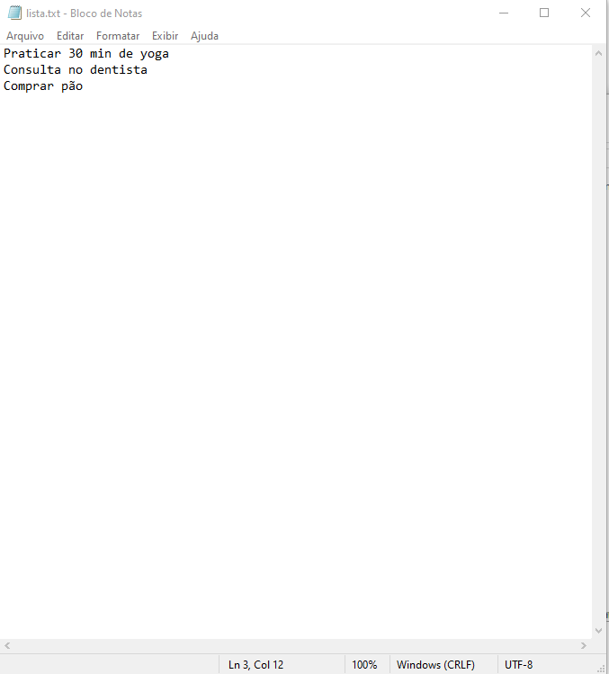

# ToDo List




> Este projeto foi criado com a finalidade de por em prática os aprendizados em java, orientação a objetos e versionamento de código, futuramente pretendo implementar um banco de dados, servidor e um aplicativo.

### Ajustes e melhorias

O projeto ainda está em desenvolvimento e as próximas atualizações serão voltadas para as seguintes tarefas:

- [x] Gerar um file txt com a list
- [ ] Implementar um banco de dados
- [ ] Implementar um servidor 
- [ ] Fazer um aplicativo


## 💻 Pré-requisitos

Antes de começar, verifique se você atendeu aos seguintes requisitos:

- JDK 17 ou acima.
- IDE para rodar aplicações java.

## ☕ Usando ToDo list

Para usar <ToDo list>, siga estas etapas:

```
- Abra o projeto em uma IDE.
- Escolha o local em que o arquivo txt com a sua lista vai ser gerada trocando o caminho nas classes AtualizarTarefa.java e DeletarTarefa.java
- Execute a classe Lista.java, localizada em ToDo-list/src/com/rogeriokogawa/todolist/app/
- Leia o menu mostrado no console para escolher a opção.
- Para parar a aplicação é preciso parar manualmente na IDE.
```

```
-Exemplo de escolha de caminho para gerar o aquivo txt na classe DeletarTarefa:


package com.rogeriokogawa.todolist.service;

import java.io.IOException;
import java.util.ArrayList;

public class DeletarTarefa {
	ListaService service = new ListaService();
	
    public void deletarTarefa(ArrayList<String> listaTarefas, int idTarefa) throws IOException{
        listaTarefas.remove(idTarefa - 1);
        service.atualizarArquivo("C:\\\\Users\\\\roger\\\\Desktop\\\\arquivotxttodolist\\\\lista.txt", listaTarefas);
    }
}

- o caminho do exemplo foi, C:\\\\Users\\\\roger\\\\Desktop\\\\arquivotxttodolist\\\\lista.txt
- É preciso fazer o mesmo na classe AtualizarTarefa.java
```
